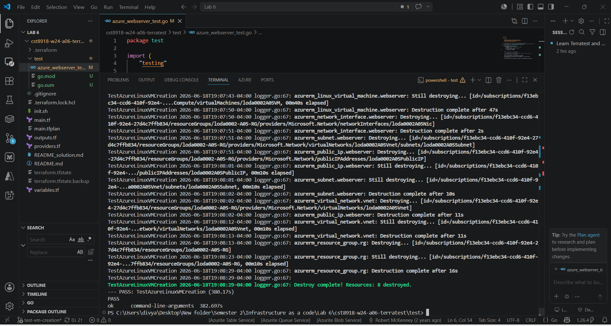
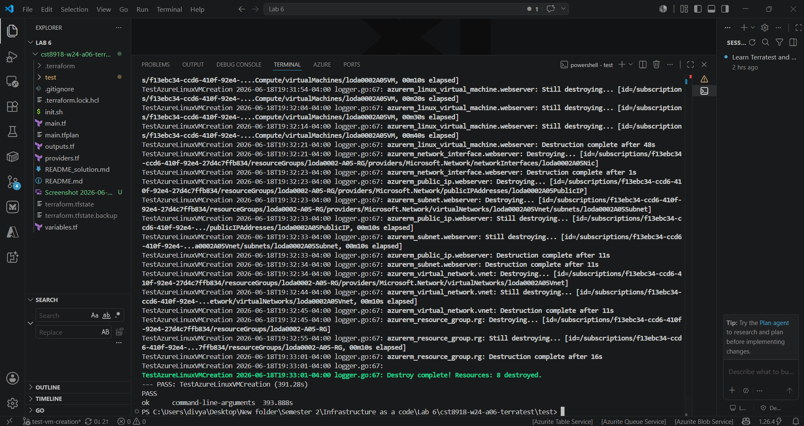

# CST8918 - Lab A06: Terratest (Automated Infrastructure Testing)

Automated tests for an Azure Linux VM built with Terraform, written in Go using **Terratest**.

## The Core Concept: What is Terratest?

Terraform builds cloud infrastructure. But it does **not** check that the infrastructure is actually correct.
When `terraform apply` succeeds, it only means *"Azure accepted my request"* — not *"the VM really exists and runs the right OS."*

**Terratest closes that gap.** It is a Go testing library that:

1. Runs `terraform apply` to build **real** resources in Azure
2. Asks the **Azure API** whether those resources are actually there and correct
3. Runs `terraform destroy` to clean everything up automatically

In one line: **it is automated integration testing for infrastructure.** Build it for real, check it for real, tear it down.

The key safety feature is Go's `defer terraform.Destroy(...)` — this guarantees the infrastructure is destroyed at the end **even if a test fails**, so you never leave resources running and burning credits.

## What the Test Checks

The test deploys the VM **once** and then verifies three things against the live Azure API:

1. The **virtual machine exists**
2. The **network interface (NIC) exists** and is **attached to the VM**
3. The VM is running the **correct Ubuntu version** (22.04 / Jammy)

Doing all checks in one deployment (instead of three separate ones) saves time and credits.

## Real-World Fixes I Had To Make

The original lab repo is from 2024. Azure changed since then, so I had to update three things to make it deploy today:

| Problem | Fix | Why |
| --- | --- | --- |
| Region `westus3` was blocked | Changed region to `canadacentral` | An Azure Policy limits the student subscription to Canadian regions (data residency) |
| Basic SKU public IP was rejected | Switched to **Standard SKU + Static** allocation | Azure retired Basic SKU public IPs (Sept 2025) |
| VM size `Standard_B1s` was unavailable | Switched to `Standard_B2ats_v2` | B1s is not offered in Canada Central for this subscription |

These weren't bugs in my code — they're a normal part of cloud work: infrastructure code "rots" as providers change quotas, policies, and retire services.

## How To Run It

First, log in to Azure:

```bash
az login
```

Then, from the `test/` folder:

```bash
go mod tidy
go test -v -timeout 30m azure_webserver_test.go
```

A successful run prints `--- PASS: TestAzureLinuxVMCreation`.

## Screenshots

**All tests passing:**



**NIC test detail:**



## Tech Used

- **Terraform** (azurerm provider)
- **Terratest v0.56.0** (Go) + **testify** assertions
- **Azure:** Linux VM, VNet, Subnet, NSG, NIC, Public IP
- **Go** testing framework